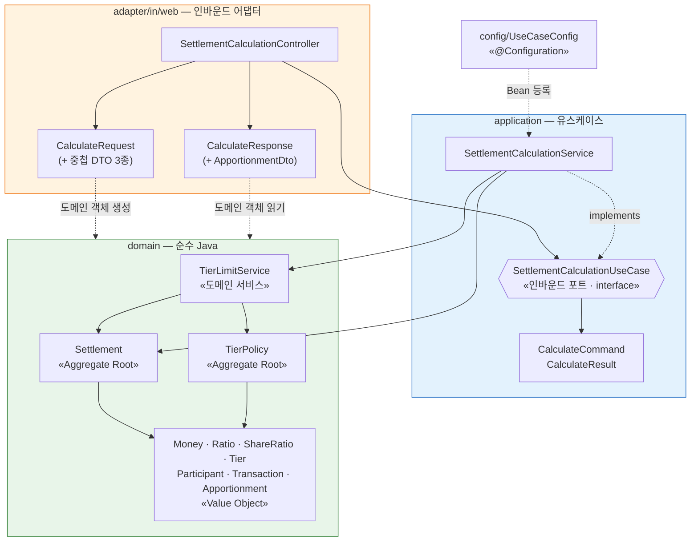
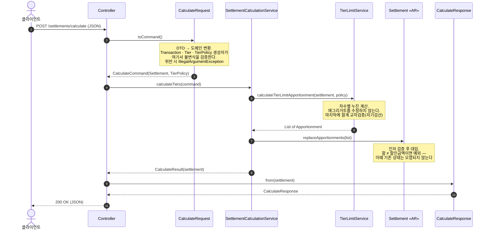

# 아키텍처 — 다단 한도 분담금 정산 엔진 (v1)

> **as-built 문서.** 설계 의도가 아니라 **현재 코드에 실제로 있는 것**을 기술한다.
> 기준: 2026-09-27 / 43 tests green
> 설계 당시의 구상은 [`design/class-diagram-v1.md`](design/class-diagram-v1.md), 도메인 규칙은 [`DOMAIN_MODEL.md`](DOMAIN_MODEL.md).

---

## 1. 이 시스템이 하는 일

1차 정산이 끝난 시점의 결제건은 분담금이 **다단 한도를 적용하지 않은 채로** 생성되어 있다.
이 엔진은 그 결과를 받아 **차수(tier)별 분담율로 누진 재계산**하고, 정산 상세를 통째로 교체한다.

핵심은 **소득세 과세표준과 같은 구조**다. 할인전 금액이 1차 한도를 넘으면 넘은 부분만 2차 분담율을 적용하고,
2차 한도를 넘으면 그 위는 3차 분담율을 적용한다. 차수가 올라갈수록 카드사 분담이 줄고 소속사 분담이 늘어난다.

**v1은 DB를 쓰지 않는다.** 아웃바운드 포트(`SettlementRepository`, `PolicyRepository`)는 스코프 아웃했고,
정책은 요청 바디로 받는다. 이 API 모양은 데모의 제약이지 설계 의도가 아니다.

---

## 2. 레이어와 의존 방향



**의존은 항상 안쪽(domain)을 향한다.** 화살표가 바깥을 가리키는 곳은 없다.

### 의존 규칙

| 레이어 | import 해도 되는 것 | 절대 안 되는 것 |
|---|---|---|
| `domain` | 자바 표준 라이브러리 | Spring, JPA, Jackson, `adapter`, `application` |
| `application` | `domain` | Spring Web, JPA, `adapter` |
| `adapter/in/web` | `application`(포트), `domain` | — |
| `config` | 전부 | — (조립 담당이므로 예외) |

> **`ArchitectureTest`(ArchUnit)가 이 규칙을 강제한다.** `domain` → `application`·`adapter`·`config`·Spring·lombok 의존과
> `application` → `adapter` 의존이 생기면 테스트가 실패한다. `config`는 조립 담당이라 검사하지 않는다.

### 포트가 `application`에 있고 어댑터가 `adapter`에 있는 이유

`SettlementCalculationUseCase`(인터페이스)는 **애플리케이션이 외부에 제시하는 계약**이다.
컨트롤러는 이 인터페이스에만 의존하므로, HTTP를 CSV 배치나 gRPC로 바꿔도 `application` 이하는 그대로다.
반대로 컨트롤러가 `SettlementCalculationService`(구현체)를 직접 알면 그 교체 가능성이 사라진다.

---

## 3. 패키지 맵

```
src/main/java/com/tieredlimit/
├── BackendApplication.java              @SpringBootApplication
│
├── domain/                              순수 Java — 프레임워크 의존 없음
│   ├── model/
│   │   ├── Money.java                   원 단위 정수 래퍼
│   │   ├── Ratio.java                   basis point (10000 = 100%)
│   │   ├── ShareRatio.java              3자 분담율 묶음 (card/participant/company)
│   │   ├── Tier.java                    차수 1개 (차수번호 · 한도 · 분담율)
│   │   ├── Participant.java             (참여사 코드, 브랜드 코드)
│   │   ├── Transaction.java             거래 금액 스냅샷
│   │   ├── Apportionment.java           분담금 1행
│   │   ├── ApportionmentType.java       CARD · PARTICIPANT · COMPANY
│   │   ├── Settlement.java              «AR» 정산 1건
│   │   └── TierPolicy.java              «AR» 다단 한도 정책
│   └── service/
│       └── TierLimitService.java        누진 계산 — 순수 계산만
│
├── application/
│   ├── port/in/
│   │   ├── SettlementCalculationUseCase.java   인바운드 포트
│   │   ├── CalculateCommand.java               (Settlement, TierPolicy)
│   │   └── CalculateResult.java                (Settlement)
│   └── service/
│       └── SettlementCalculationService.java   오케스트레이션
│
├── adapter/in/web/
│   ├── CalculateRequest.java            요청 DTO + 도메인 변환
│   ├── CalculateResponse.java           응답 DTO + 도메인 → DTO
│   └── SettlementCalculationController.java
│
└── config/
    └── UseCaseConfig.java               Bean 조립
```

### `application`이 `@Service`를 안 쓰는 이유

`SettlementCalculationService`에는 스프링 애너테이션이 **하나도 없다.** 대신 `config/UseCaseConfig`가 `@Bean`으로 등록한다.

- **얻는 것**: `application` 레이어가 스프링을 import하지 않는다. 순수 JUnit으로 `new`해서 테스트할 수 있다(실제로 `SettlementCalculationServiceTest`가 그렇게 한다 — 스프링 컨텍스트를 띄우지 않아 빠르다).
- **치르는 비용**: 빈이 늘어날 때마다 `UseCaseConfig`에 등록 코드를 손으로 추가해야 한다. `@Service` 한 줄이면 끝날 일이 두 곳으로 나뉜다.
- **어느 쪽이 이기나**: 유스케이스가 소수이고 레이어 순수성을 학습·검증 목적으로 지키는 지금은 `@Bean`이 낫다. 유스케이스가 수십 개로 늘면 등록 코드가 부담이 되어 `@Service`로 기우는 게 보통이다.

---

## 4. 요청 1건이 흐르는 길



### 이 흐름의 세 가지 설계 결정

**(1) 변환은 중첩 record가 각자 소유한다**
`TransactionDto.toTransaction()`, `TierPolicyDto.toTierPolicy()`, `TierDto.toTier()`가 각자 자기 몫만 변환하고,
바깥 `CalculateRequest.toCommand()`는 **애그리거트 조립만** 한다. 변환 로직이 한 메서드에 뭉치지 않는다.

**(2) 도메인 서비스는 애그리거트를 침범하지 않는다**
`TierLimitService`는 `List<Apportionment>`를 **반환만** 하고, `Settlement`을 고치지 않는다.
상태를 바꾸는 것은 애그리거트 자신(`replaceApportionments`)이다 — Tell, Don't Ask.
오케스트레이션(계산 → 교체) 순서는 `application`이 쥔다.

**(3) `CalculateResponse.from()`은 static 팩터리다**
생성자가 아닌 이유 세 가지 — ⓐ 변환 시점에 만들 객체가 아직 없다(`Settlement`에서 뽑아내야 한다)
ⓑ record의 canonical 생성자는 이미 필드 시그니처가 점유하고 있다 ⓒ `from`이라는 이름이 "무엇으로부터 만든다"를 말해준다.

### 응답의 `totalDiscountAmount`는 분담금 합이 아니다

```java
settlement.getTransaction().discountAmount().value()   // 거래의 할인금액에서 꺼낸다
```

분담금 합으로 다시 계산하면 **응답 안에서 항상 참인 동어반복**이 된다. 그러면 클라이언트가 검산할 수단이 사라진다.
출처가 다른 두 값을 나란히 내보내야 "이 둘이 같은가"가 의미 있는 질문이 된다.

---

## 5. 각 레이어의 책임

| 레이어 | 책임진다 | 책임지지 않는다 |
|---|---|---|
| `adapter/in/web` | HTTP·JSON, DTO ↔ 도메인 변환, **상태코드** | 계산 규칙, 불변식 |
| `application` | 오케스트레이션 순서, 트랜잭션 경계(v1엔 없음) | 계산 규칙, HTTP |
| `domain/service` | 누진 계산 알고리즘, 자기검산 | 상태 변경, 영속화 |
| `domain/model` | **불변식**, 상태 변경의 캡슐화 | 계산 오케스트레이션, HTTP |

**HTTP 상태코드가 어댑터의 책임이라는 점이 중요하다.** 도메인은 `IllegalArgumentException`만 던지고 HTTP를 모른다.
그것을 400으로 번역하는 건 웹 어댑터의 일이다 — 아직 안 되어 있고, [7. 알려진 한계](#7-알려진-한계)에 있다.

---

## 6. 실행 · 테스트

```bash
# 실행
./gradlew bootRun

# 테스트 (43개)
./gradlew test
```

### 테스트 구성

| 층위 | 파일 | 방식 |
|---|---|---|
| VO·애그리거트 단위 | `MoneyTest` `RatioTest` `ShareRatioTest` `TierTest` `ParticipantTest` `TransactionTest` `SettlementTest` `TierPolicyTest` | 순수 JUnit |
| 유스케이스 | `SettlementCalculationServiceTest` | 순수 JUnit (`new`로 생성, 스프링 없음) |
| HTTP 통합 | `SettlementCalculationControllerTest` | `@SpringBootTest` + `MockMvc` — 요청 JSON부터 응답 JSON까지 |
| 컨텍스트 로딩 | `BackendApplicationTests` | `@SpringBootTest` |
| 의존 규칙 | `ArchitectureTest` | ArchUnit — 컴파일된 클래스의 레이어 간 의존 검사 |

**통합 테스트의 기대값은 전부 손으로 계산한 리터럴이다.** 프로덕션 코드에서 뽑아 쓰면 테스트가 자기 자신을 증명하는 꼴이 된다.

통합 테스트는 총율이 다른 두 정책을 각각 검증한다(50% / 30%). 총율 50% 하나만 있으면
`할인전 − 할인 = 승인`이라는 불변식 때문에 **`할인 = 승인`이 구조적으로 항상 참**이 되어,
응답의 `discountAmount`를 `approvedAmount`로 바꿔도 테스트가 통과한다.
30% 케이스는 그 항등을 깨서 이 결함을 잡는다.

---

## 7. 알려진 한계

**의도한 것**과 **못 한 것**을 구분해 적는다. 섞이면 다음 사람이 의도를 실수로 되돌린다.

### 의도한 것 (고치지 말 것)

| 항목 | 왜 이렇게 두었나 |
|---|---|
| **`Settlement` 생성자가 분담금을 검증하지 않는다** | 이 엔진의 존재 이유가 *틀린 1차 결과를 받아서 고치는 것*이다. 입구를 막으면 정작 고쳐야 할 대상을 받지 못한다. **입구는 넓게, 출구는 좁게** — 출구(`replaceApportionments`)에서만 검증한다. |
| **`TierLimitService`의 `IllegalStateException`은 HTTP 500으로 나간다** | 이 예외는 **엔진이 자기 계산을 검산하다 실패한 것**이다. 정상 입력이라면 절대 터지면 안 되고, 터졌다면 우리 코드가 틀렸다는 뜻이다. 400으로 내리면 "네 요청이 잘못됐다"고 **거짓말**하게 된다. 실제로 2026-08-26의 차수 정렬 버그가 이 경로로 드러났다 — 요청은 완벽히 유효했고 틀린 건 우리였다. |
| **정책을 요청 바디로 받는다** | v1이 아웃바운드 포트(DB)를 스코프 아웃했기 때문. 운영에서는 `(참여사, 브랜드, 카드사, 카드종류)` 키로 조회한다. |
| **잔돈은 소속사가 흡수한다** | 정수 나눗셈 내림 때문에 3자 합이 할인금액보다 몇 원 적을 수 있다. 마지막 party가 차액을 흡수해 **합 불변식을 보장**한다. |

### 못 한 것 (v1.1 이후)

| # | 항목 | 현재 상태 | 해야 할 일 |
|---|---|---|---|
| 1 | **`IllegalArgumentException` → 400 매핑** | 도메인 불변식 위반이 **HTTP 500**으로 나간다. 클라이언트 입력 오류인데 서버가 자기 잘못이라고 답한다. | `adapter/in/web`에 `@RestControllerAdvice`. `IllegalStateException`은 **매핑하지 않고 500 유지**(위 표 참고) — 그 의도를 핸들러에 주석으로 남길 것. |
| 2 | **`NullPointerException` → 400 매핑** | `tiers` 배열에 null 원소가 오면 `List.copyOf`가 NPE를 던지고 500이 된다. | 1번과 함께. 나아가 도메인에서 **메시지 있는 `IllegalArgumentException`**으로 바꾸는 편이 낫다. |
| 3 | **예외 타입 일관성** | `TierLimitService`=ISE, 나머지 도메인=IAE, null 가드=NPE. 규칙은 있지만(입력=IAE, 자기검산=ISE) NPE가 규칙 밖에 있다. | null 가드를 명시적 IAE로. |
| 4 | **차수 0개 정책에 가드가 없다** | `tiers`가 빈 리스트면 두 불변식 모두 통과하고, 계산은 분담금 0원 3행을 만든 뒤 합 검증에서 터진다. | `TierPolicy` 생성자에 빈 리스트 가드. |
| 5 | **`tierNo` 중복에 가드가 없다** | 한도만 오름차순이면 `tierNo`가 `[1, 1, 2]`여도 통과한다. | 중복 검사. |
| 6 | **`Money`에 가드가 없다** | 음수·null 검증이 없다. 취소건(음수 할인)을 위해 열어둔 것인지 미결정. | 취소건 구현과 함께 결정. |
| 7 | **취소 거래 미구현** | `TierLimitService`가 `할인금액 > 0`일 때만 계산하고, else 블록은 **의도된 공백**이다. | 원승인 건을 찾아 부호만 뒤집는 처리. |
| 8 | **아웃바운드 포트 없음** | DB를 쓰지 않는다. 의존성에도 JPA·DB 드라이버가 없다. | `SettlementRepository` · `PolicyRepository` + JPA 어댑터. |
| 9 | **테스트 단언 스타일 혼재** | `assertThrows`(JUnit)와 `assertThatThrownBy`(AssertJ)가 섞여 있다. | 한쪽으로 통일. |

### v1에서 아예 다루지 않는 것

결제 승인 실시간 흐름 · SAP/EAI 실연동 · 어드민 UI · 다단 한도 비대상 카드의 기본 계산식.

---

## 8. 스택

Java 21 · Spring Boot 4.0.6 (Web MVC) · Gradle · JUnit 5 · AssertJ · ArchUnit
