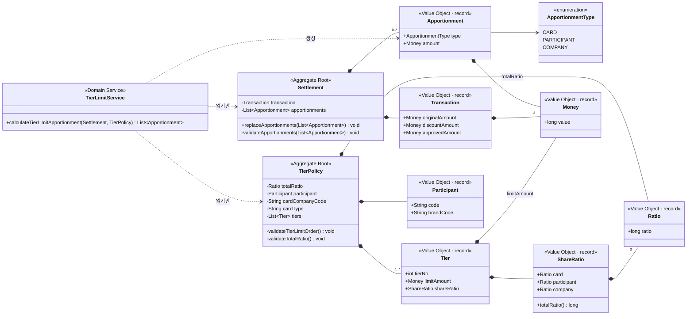

# 도메인 모델 — 다단 한도 분담금 정산 엔진 (v1)

> **as-built 문서.** 현재 코드에 실제로 있는 타입과 규칙만 기술한다.
> 기준: 2026-08-26
> 레이어 구조는 [`ARCHITECTURE.md`](ARCHITECTURE.md), 설계 당시 구상은 [`design/class-diagram-v1.md`](design/class-diagram-v1.md).

---

## 1. 클래스 다이어그램



**두 개의 애그리거트가 서로를 참조하지 않는다.** `Settlement`은 정책을 모르고, `TierPolicy`는 거래를 모른다.
둘을 만나게 하는 것은 `TierLimitService`(계산)와 `CalculateCommand`(전달)뿐이다.

---

## 2. 계산 규칙 — 누진 분담

### 원리

**소득세 과세표준과 같다.** 할인전 금액을 차수 한도로 구간을 나누고, **각 구간에 그 차수의 분담율을 적용**한다.
전체 금액에 최고 차수 분담율을 적용하는 게 아니다.

### 예시 — 할인전 500,000원 / 총율 30% / 3차 정책

> 이 문서와 테스트에 나오는 한도·분담율·총할인율·코드값은 모두 설명을 위한 가상값이다.

| 차수 | 한도 | 적용 구간 | 구간폭 | 구간 할인(×30%) | 카드사 | 참여사 | 소속사 |
|---|---|---|---|---|---|---|---|
| 1차 | 300,000 | 0 → 300,000 | 300,000 | 90,000 | 5% → **15,000** | 5% → **15,000** | 20% → **60,000** |
| 2차 | 400,000 | 300,000 → 400,000 | 100,000 | 30,000 | 0% → **0** | 15% → **15,000** | 15% → **15,000** |
| 3차 | 600,000 | 400,000 → 500,000 | 100,000 | 30,000 | 0% → **0** | 10% → **10,000** | 20% → **20,000** |
| | | | | **150,000** | **15,000** | **40,000** | **95,000** |

세 합 150,000 = 500,000 × 30%. **총할인율은 구간이 몇 개로 쪼개지든 보존된다.**
차수가 올라갈수록 카드사 분담이 줄고 소속사 분담이 늘어난다 — 정책의 의도가 그렇다.

3차 한도(600,000)가 할인전 금액(500,000)보다 크므로 마지막 구간은 **한도가 아니라 실제 금액에서 끊긴다.**
`min(차수 한도, 할인전 금액)`이 필요한 이유다.

### 의사코드 (`TierLimitService`)

```
남은할인 = 거래.할인금액
누적한도 = 0

for 차수 in 정책.차수들:                    # tierNo 오름차순으로 보장됨
    구간율 = 카드율 + 참여율 + 소속율
    구간폭 = min(차수.한도, 할인전금액) - 누적한도
    구간할인 = min(구간폭 × 구간율 / 10000, 남은할인)

    카드누적  += 구간할인 × 카드율  / 구간율
    참여누적  += 구간할인 × 참여율  / 구간율
    소속누적  += 구간할인 × 소속율  / 구간율

    남은할인 -= 구간할인
    누적한도 += 구간폭

if 남은할인 > 0:                            # 최고 차수 한도 초과분
    소속누적 += 남은할인

합 = 카드누적 + 참여누적 + 소속누적
if |합 - 할인금액| > 허용치:                 # 자기검산 — 아래 참고
    throw IllegalStateException

소속누적 += (할인금액 - 합)                  # 잔돈 흡수
```

### 정수 연산에 대한 세 가지 결정

**(1) 금액·분담율은 전부 `long`이다.** `BigDecimal`·`double`은 기각했다.
금액은 원 단위 정수, 분담율은 **basis point**(10000 = 100%)로 표현한다.
정산 도메인에서 부동소수점은 재현 불가능한 오차를 만들고, `BigDecimal`은 코드가 무거워진다.

**(2) 곱셈을 먼저, 나눗셈을 나중에 한다.**

```java
cardShare += tierDiscount * cardRatio / totalRatio;   // O
cardShare += tierDiscount * (cardRatio / totalRatio); // X — 정수 나눗셈이 먼저 0이 된다
```

`cardRatio / totalRatio`를 먼저 계산하면 정수 나눗셈이라 대부분 0이 되어 **분담금이 통째로 사라진다.**

**(3) 잔돈은 마지막 party가 흡수한다.**
정수 나눗셈은 항상 내림이므로, 3자에게 나눈 합이 원래 금액보다 몇 원 적을 수 있다.
차액을 소속사에 더해 **`분담금 합 = 할인금액`이라는 불변식을 정확히** 맞춘다.

### 자기검산과 허용치

```java
final int TOLERANCE = tierPolicy.getTiers().size() * 3;
if (Math.abs(sum - discount) > TOLERANCE) {
    throw new IllegalStateException("분담 합 " + sum + " ≠ 할인금액 " + discount);
}
```

**허용치가 `차수 수 × 3`인 이유**: 차수마다 3자에게 나눌 때 내림으로 party당 최대 1원씩 잃을 수 있다.
차수당 최대 3원, 전체로 `차수 수 × 3`원. 그 안이면 **잔돈**이라 흡수하고, 넘으면 **잔돈이 아니라 계산 오류**다.

이 예외는 클라이언트 잘못이 아니라 **엔진 자신의 버그를 알리는 신호**다.
실제로 2026-08-26의 차수 정렬 버그가 이 검산에 걸려 드러났다 — 요청은 완벽히 유효했고, 30,000원이 허공에서 생겼다.
그래서 이 예외만은 **HTTP 500이 맞다.**

---

## 3. 불변식이 어디에 있고, 왜 거기인가

이 프로젝트에서 가장 많이 고민한 부분이다. **규칙을 어느 클래스에 둘지가 곧 책임의 배치**다.

### 배치 기준

| 성격 | 어디에 두나 | 이유 |
|---|---|---|
| **변하지 않는 값**의 불변식 | **생성자** | 한 번 만들어지면 끝이라 만들 때 막으면 영원히 안전하다 |
| **변하는 상태**의 불변식 | **상태를 바꾸는 메서드** | 생성 시점에 검사해봐야 나중에 바뀌면 소용없다 |
| 여러 값의 **관계** | **관계를 아는 쪽**(대개 애그리거트 루트) | 부분만 보는 VO는 전체 관계를 알 수 없다 |
| **구체적인 유효 조합** | **DB 등록이 보증** | 브랜드마다 다르고 운영 중 바뀐다. 코드에 숫자를 박으면 배포 없이 못 바꾼다 |

### 전체 목록

| 타입 | 불변식 | 위치 | 비고 |
|---|---|---|---|
| `Money` | **없음** | — | 음수·null 가드 없음. 취소건(음수 할인) 대비인지 미결정 |
| `Ratio` | `0 ≤ ratio ≤ 10000` | 생성자 | basis point 범위 |
| `ShareRatio` | 3개 모두 non-null | 생성자 | **합 검증은 하지 않는다** — 아래 참고 |
| `Tier` | non-null, `tierNo > 0`, `한도 > 0` | 생성자 | |
| `Participant` | 두 코드 모두 non-null | 생성자 | |
| `Transaction` | non-null, **`할인전 − 할인 = 승인`** | 생성자 | 세 금액이 함께 변하지 않는 값이므로 생성자 |
| `Apportionment` | **없음** | — | |
| `Settlement` | **`분담금 합 = 할인금액`** | `replaceApportionments()` | **생성자에는 없다** — 아래 참고 |
| `TierPolicy` | ① 차수 한도가 **strictly increasing** | 생성자 → `validateTierLimitOrder()` | |
| `TierPolicy` | ② **모든 차수의 분담율 합 = 정책의 `totalRatio`** | 생성자 → `validateTotalRatio()` | 아래 상세 |
| `TierLimitService` | `분담금 합 ≈ 할인금액` (허용치 내) | 계산 마지막 | 자기검산 |

### `ShareRatio`가 합을 검증하지 않는 이유

한때 `합 ∈ {5000, 2000}`을 하드코딩했다가 **삭제했다.** 두 가지가 틀렸기 때문이다.

1. **총율이 한 가지가 아니다** — 예컨대 2000·3000·5000이 공존하면 `{5000, 2000}`은 3000을 거부한다.
2. **같은 카드종류라도 브랜드마다 다르고, 운영 중 바뀔 수 있다.** 즉 `카드종류 → 총율`은 함수가 아니다.

그래서 총율은 **정책 테이블의 컬럼**이고, `TierPolicy`가 `Ratio totalRatio` **필드로 보유**한다.
`ShareRatio`는 3자 분담율을 묶어 나르고 합을 **계산해 주기만**(`totalRatio()`) 한다.

> **원칙**: 코드에는 **숫자**가 아니라 **관계**만 남긴다.
> "합이 5000이어야 한다"는 숫자고, "모든 차수의 합이 정책 선언값과 같아야 한다"는 관계다.
> 앞의 것은 브랜드가 하나 늘면 틀리고, 뒤의 것은 영원히 참이다.

### 불변식 ②가 깨지는 두 가지 유형

`validateTotalRatio()`가 잡아야 할 것은 두 종류다.

- **유형 A — 차수끼리 서로 다름.** 1차는 합 5000인데 2차는 3000.
- **유형 B — 차수끼리는 전부 같은데, 정책 선언값과 다름.** 모든 차수가 3000인데 정책 헤더의 `totalRatio`는 5000.
  정책 선언값만 바뀌고 차수 행은 그대로인 경우다.

**유형 B가 `totalRatio` 필드의 존재 이유다.** 차수끼리만 비교하는 구현은 유형 B를 절대 못 잡는다.
그래서 검증의 **앵커가 `tiers.get(0)`이 아니라 `this.totalRatio`**여야 한다.

> **뮤테이션 테스팅으로 확인한 적이 있다.** 앵커를 `tiers.get(0)`으로 되돌려도 테스트가 전부 초록이었다.
> 유형 B 테스트를 추가하고서야 그 변형이 죽었다.

### `Settlement` 생성자가 분담금을 검증하지 않는 이유

**이 엔진의 존재 이유가 "틀린 1차 결과를 받아서 고치는 것"이다.**
입구에서 막으면 정작 고쳐야 할 대상을 받지 못한다. 미생성 건은 분담금이 **빈 리스트**로 들어오기도 한다.

**입구는 넓게, 출구는 좁게.** 출구의 규칙은 `분담금 합 = 할인금액` 하나뿐이고, 이 하나로
빈 리스트+할인 0 / +250,000 / −250,000(취소건) 세 경우가 **분기 없이** 처리된다.

### 검증 후 대입 — 실패 원자성

```java
public void replaceApportionments(List<Apportionment> newApportionments) {
    validateApportionments(newApportionments);        // ① 인자를 먼저 검증
    this.apportionments = List.copyOf(newApportionments);  // ② 통과해야 대입
}
```

대입을 먼저 하고 필드를 검증하면, 예외가 나가도 **상태는 이미 오염된 뒤**다.
인자를 검증하고 대입하면 예외 시 객체가 원래 상태 그대로다 — *Effective Java* 76 **실패 원자성**.

`TierPolicy` 생성자도 같은 성질을 얻는다. `List.copyOf(...)`가 NPE를 던지면 대입 자체가 실행되지 않고,
생성자가 예외로 빠져나가므로 **불완전한 객체가 존재하지 않는다.**

> **`assertThrows`만으로는 두 순서를 구분하지 못한다.** 어느 쪽이든 예외는 똑같이 나온다.
> `SettlementTest`에 **예외 후 상태가 그대로인지 확인하는 assert**가 따로 있는 이유다.

### 차수 순서 — `tierNo`가 단일 진실 원천

`TierPolicy` 생성자는 차수를 **`tierNo` 오름차순으로 정렬해서 보관**한다.

```java
this.tiers = List.copyOf(tierPolicies.stream().sorted(comparingInt(Tier::tierNo)).toList());
```

**왜 정렬해서 보관하나**: 리스트의 물리적 순서는 `tierNo`와 중복된 정보다. 둘이 어긋나면 **진실 원천(`tierNo`)을 따른다.**
정책의 출처가 REST 바디에서 DB로 바뀌면 `ORDER BY tier_no` 누락이 실제로 일어나는데, 그때 조용히 틀린 금액이 나가는 것보다 안전하다.

**왜 `List.copyOf`로 감싸나**: `stream().toList()`는 불변 리스트를 주지만 **null 원소를 허용한다.**
`List.copyOf`는 불변성에 더해 **null을 거부(NPE)** 한다. 두 보장을 다 얻으려면 바깥이 `List.copyOf`여야 한다.

> **이전 버그**: 정렬은 `validateTierLimitOrder()` 안의 **지역변수**에서만 일어나고 필드는 입력 순서 그대로였다.
> 그래서 **검증은 정렬본으로, 계산은 원본으로** 하는 어긋남이 생겼다 —
> 요청의 `tiers`가 `[2차, 1차, 3차]` 순이면 불변식은 통과하는데 누진 계산만 틀렸다.
> 고친 방법은 **정렬 코드를 한 곳으로 통일**하는 것이었다: 필드를 정렬해 담고, 검증 메서드는 필드를 그대로 순회한다.

---

## 4. 용어

> 여기 있는 것은 **코드에 실제로 나타나는 이름**뿐이다.
> 업무 용어까지 포함한 정식 용어집(ubiquitous language)은 별도 문서에서 다룬다.

| 코드 이름 | 우리말 | 뜻 |
|---|---|---|
| `Settlement` | 정산 | 결제 1건의 정산 결과. 거래 스냅샷 + 분담금 목록 |
| `Transaction` | 거래 | 결제 금액 3종. 할인전 / 할인 / 승인 |
| `originalAmount` | 할인전 금액 | 할인 적용 전 결제 금액. **다단 한도의 기준값** |
| `discountAmount` | 할인 금액 | 할인액. 3자가 나눠 부담한다 |
| `approvedAmount` | 승인 금액 | 카드사에 실제 승인된 금액 = 할인전 − 할인 |
| `Apportionment` | 분담금 | 할인액 중 한 party가 부담하는 몫. party별 1행 |
| `ApportionmentType` | 분담 유형 | `CARD`(카드사) / `PARTICIPANT`(참여사) / `COMPANY`(소속사) |
| `TierPolicy` | 다단 한도 정책 | 차수 목록 + 총할인율. 키 = (참여사, 브랜드, 카드사, 카드종류) |
| `Tier` | 차수 | 한도 구간 1개. 차수번호 + 한도금액 + 3자 분담율 |
| `tierNo` | 차수 번호 | 1차, 2차, 3차… **차수 개수는 정책마다 다르다** |
| `limitAmount` | 차수 한도 | 이 차수가 담당하는 구간의 상한 |
| `ShareRatio` | 분담율 묶음 | 한 차수의 3자 분담율 |
| `totalRatio` | 총할인율 | 정책 전체의 할인율. 정책마다 다를 수 있다(예: 2000·3000·5000) |
| `Ratio` | 비율 | basis point. 10000 = 100%, 5000 = 50% |
| `Money` | 금액 | 원 단위 정수 |
| `Participant` | 참여사 | (참여사 코드, 브랜드 코드) — 항상 같이 다니는 키 묶음 |
| `cardType` | 카드 종류 | 정책 키의 일부. 값은 정책 테이블이 정의한다. **다단 한도 대상은 일부 카드 종류뿐** |

### 3자가 누구인가

| 분담 유형 | 누구 | 성격 |
|---|---|---|
| `CARD` | 카드사 | **차수가 올라갈수록 분담이 줄어든다.** 3차에선 0인 경우가 흔하다 |
| `PARTICIPANT` | 참여사 | 브랜드를 운영하는 제휴사 |
| `COMPANY` | 소속사 | 임직원이 속한 회사. **차수가 올라갈수록 분담이 늘고, 잔돈과 초과분을 흡수한다** |

---

## 5. 코드에 아직 없는 것

설계 문서(`design/class-diagram-v1.md`)에는 있지만 **v1 코드에는 구현하지 않은** 것들이다.
자리만 비워둔 게 아니라 **의식적으로 미룬** 것이므로, 코드를 읽을 때 "빠뜨렸나?" 하지 말 것.

| 설계에 있던 것 | 현재 | 왜 미뤘나 |
|---|---|---|
| `TransactionKey` VO (카드사 거래 식별 키) | **없음** | 식별자는 DB 조회·중복검사에 필요한데 v1은 DB를 안 쓴다. `Settlement.java`에 주석으로 자리만 남아 있다 |
| `Transaction`의 `memberId` · `memberType` · `franchiseNo` | **없음** | 회원유형(일반/임직원)이 분담율에 영향을 주는지 미확인. 카드종류 축과 중복 가능성도 미해결 |
| `Settlement`의 `participant` 필드 | **없음** | 정책 쪽에만 있으면 v1 계산에 충분하다 |
| `SettlementValidationService` (중복거래·취소/승인 대응·가맹점 존재) | **없음** | 전부 Repository가 필요한 교차도메인 검증. 아웃바운드 포트와 함께 온다 |
| `CardType` enum | **없음** (`String cardType`) | 불변식이 `cardType`을 쓰지 않는다. 게다가 **축이 미확정**이다 — 카드 종류 축과 회원유형 축이 중복될 수 있다. 1축인가 2축(회원구분 × 카드구분)인가 |
| `PolicyKey` VO / `PolicyResolver` | **없음** | v1은 키 조회 자체가 없다 |

### 미해결 도메인 질문

1. **회원유형 축** — 카드 종류 축과 회원유형 축이 중복될 수 있다. 1축인가, 2축(`회원구분 × 카드구분`)인가?
   → **다단 한도 비대상 카드의 기본 계산식 요구사항이 확정돼야** 결정할 수 있다.
2. **다단 한도 비대상 카드 경로** — 기본 계산식을 쓴다. 별도 경로가 필요한지 v2에서 판단.
3. **1차 결과에 합≠할인금액인 데이터가 실재하는가** — 실재한다면 `Settlement` 생성자에서도 검사할지 재검토.
