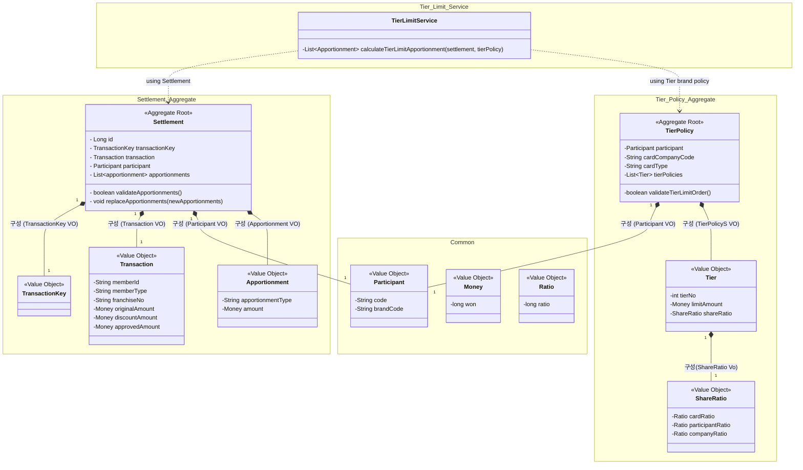

# 클래스 다이어그램 v1 — 다단 한도 분담금 정산 엔진

> ⚠️ **이 문서는 2026-06-03 시점의 *설계 스냅샷*이다. 현재 코드와 다르다.**
> 코드를 이해하려면 [`../DOMAIN_MODEL.md`](../DOMAIN_MODEL.md)(as-built)를 먼저 보라.
> 이 문서는 **"무엇을 구상했고 무엇을 안 만들었나"의 기록**으로 남긴다 — 갱신하지 않는다.
>
> 원본 기록: 확정 2026-06-03 / 문서화 2026-06-20
>
> 공개본에서는 거래 식별 키의 구성 필드를 생략하고, 운영 절차를 드러내는 일부 표현을 일반화했다. 설계 구조는 스냅샷 그대로다.

## 설계본 → 현재 코드

구현하면서 바뀐 것들이다. 대부분은 **설계가 틀려서**가 아니라 **v1 스코프가 좁아서**다.

| 설계본 | 현재 코드 | 왜 |
|---|---|---|
| `Settlement`이 `TransactionKey`·`Participant` 보유 | **둘 다 없음** | 식별자는 DB 조회·중복검사용인데 v1은 DB를 안 쓴다. `Settlement.java`에 주석으로 자리만 남아 있다 |
| `Transaction`에 `memberId`·`memberType`·`franchiseNo` | **금액 3종만** | 회원유형이 분담율에 영향을 주는지 미확인 |
| `TierPolicy` 필드 = 정책 키 + 차수 목록 | **`Ratio totalRatio` 추가** | 2026-08-02에 발견: 총율이 한 가지가 아니고(예: 2000·3000·5000) **브랜드마다 다를 수 있다**. `카드종류 → 총율`이 함수가 아니므로 정책이 값으로 들고 있어야 한다 |
| `TierPolicy`의 불변식 = 차수 한도 순서 하나 | **`validateTotalRatio()` 추가** | 모든 차수의 분담율 합 = 정책 선언 총율. **정책 선언값만 바뀌고 차수 행은 그대로인 경우**를 잡는다 |
| `TierPolicy.tierPolicies` (필드명) | `tiers` | 리네이밍 |
| 차수 리스트를 입력 순서대로 보관 | **`tierNo` 오름차순 정렬 후 보관** | 검증은 정렬본, 계산은 원본을 보던 버그(2026-08-26) |
| `ShareRatio`가 합 불변식 보유 | **null 가드만** | 합이 `{5000, 2000}`이라는 하드코딩은 3000을 거부해 틀렸다. 총율 검증은 루트(`TierPolicy`)로 이관 |
| `ShareRatio` 필드 `cardRatio`/`participantRatio`/`companyRatio` | `card`/`participant`/`company` | 타입이 이미 `Ratio`라 접미사가 중복 |
| `Money.won` | `Money.value` | |
| `Apportionment.apportionmentType` = `String` | **`ApportionmentType` enum** | |
| `cardType` = `String` | **그대로 `String`** | enum으로 못 바꿨다 — 불변식이 `cardType`을 쓰지 않고, **축이 미확정**(1축 3값 vs 회원구분×카드구분 2축) |
| `SettlementValidationService` | **없음** | Repository가 필요한 교차도메인 검증 — 아웃바운드 포트와 함께 온다 |
| `Settlement.validateApportionments()` public | **`private`** | `replaceApportionments()`가 스스로 호출. 외부에 검증을 노출할 이유가 없다 |

> 아래 다이어그램은 **당시 그대로** 둔다. 위 표와 대조해서 읽을 것.

## 열린 논점 (2026-06-20 기준) — 결론

- ~~`Tier.tier`(차수번호) 필드 보유 여부 vs `List<Tier>` 인덱스로 순서 표현~~
  → **`tierNo` 필드 보유로 결정.** 인덱스는 순서를 *암묵적으로* 표현하는데, 그러면
  "리스트가 정렬되어 있다"는 전제를 아무도 보증하지 못한다. 실제로 2026-08-26에 그 전제가 깨져 버그가 났고,
  `tierNo`라는 **명시적 진실 원천**이 있었기에 정렬해서 복구할 수 있었다. 인덱스였다면 복구할 근거 자체가 없다.
- `Tier` 자체 불변식 경계: 차수번호 음수 금지 / 한도 0 허용 여부 / "차수 증가 시 한도 증가"는 `TierPolicy.validateTierLimitOrder()` 책임.